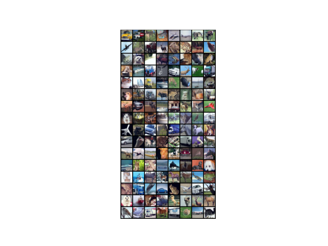

# Understanding generalization in deep learning

A work on generalization in deep learning, let's try to reproduce CIFAR10 experiments from figure 1 and 2 from:

> Chiyuan Zhang, Samy Bengio, Moritz Hardt, Benjamin Recht, Oriol Vinyals. Understanding deep learning requires rethinking generalization. International Conference on Learning Representations (ICLR), 2017. [Arxiv](https://arxiv.org/abs/1611.03530).

<details>
<summary>Code organization</summary>

Go to the `src/` directory, then you will find the following programs

- `checkpoints` and `experiments` will be automatically created for storing models' `.pt` and `.yaml` configuration files respectively
- `models/` directory with implemented models (detailed above)
- `plots/` plots from data samples and results
- `main_fig1.py` `main_fig2.py` main script from which a single experiment can be launched using command line, different main for experiments from figure 1 and figure 2
- `main_models.py` quick main program for inspecting models (architecture, number of parameters...) with same arguments as the main programs
- `train.py` used in main script, contains training utilities
- `cifar10.py` wrapper of torchvision CIFAR10 that supports label and data corruption using `ModifiedCIFAR10` class
- `utils.py` more utilities
- `config-f1.yaml` `config-f2.yaml` base configuration for experiments

Use `python main-f1.py --help` and `python main-f2.py --help` to show program arguments

</details>


### :open_file_folder: Details

Supervised learning on CIFAR10, how far can we push neural nets?

<details open>
<summary>Models</summary>

You can find all the implemented models in the `src/models/` directory, go to the `src/` folder then use for example `python main_models.py --config experiments/MLP1/MLP1_0.0_none.yaml`

Model | Params | `batch_size` | `learning_rate` | `momentum` | `lr_decay`
----- | ------ | ------------ | --------------- | ---------- | ---------
`MLP1` | 1,209,866 | `128` | `0.01` | `0.9` | `0.95`
`AlexNet` | 1,375,690 | `128` | `0.01` | `0.9` | `0.95`
`Inception` | 1,651,114 | `128` | `0.1` | `0.9` | `0.95`

No weight decay, dropout or other forms of explicit regularization

`Inception` has also the flag for using the batch norm layer, default is `bn=True` this will be used for the experiments from figure 2

</details>

<details open>
<summary>Data</summary>

In a nushell:

- Experiments from figure 1: corrupt labels (non shown here) and data (in three different ways) then see if neural nets can still learn where no relationship between data and labels exists
- Experiments from figure 2: see the effect of batch norm on Inception architecture with original data

CIFAR10 | Shuffled pixels | Random pixels | Gaussian pixels
-- | -- | -- | --
 |  |  | 

</details>


## :one: Experiments from Figure 1

<details>
<summary>Configuration files</summary>

Experiments naming: `model_name`\_`label_corruption_prob`\_`data_corruption_type`

- `batch_size: 128`
- `checkpoint_dir: checkpoints/MLP1` or `checkpoints/AlexNet` or `checkpoints/Inception`
- `checkpoint_every: null`
- `comet_project: `
- `config: experiments/MLP1/MLP1_0.0_none.yaml` (as an example)
- `curve: false`
- `data_corruption_type: none`
- `device: cuda`
- `experiment_key: ` (see main program)
- `experiment_name: MLP1_0.0_none`
- `figure1: true`
- `interp_reached: false`
- `label_corruption_prob: 0.0`
- `learning_rate: 0.01`
- `log_every: 50`
- `lr_decay: 0.95`
- `model_name: MLP1` or `AlexNet` or `Inception`
- `momentum: 0.9`
- `num_epochs: 10`
- `num_workers: 2`
- `resume_checkpoint: ` (see training loop)
- `seed: 42`
- `weight_decay: 0.0`

```
python main_fig1 --config experiments/MLP1/MLP1_0.0_none.yaml
```

</details>

<details>
<summary>Learning curves</summary>

Loss per training step varying randomization test

- **True labels**: original CIFAR10 dataset `p=0.0`
- **Random labels**: dataset with random labels both train and test, probability (fraction) specified by `p=1.0`
- **Shuffled pixels**: a fixed pixels permutation is applied to train and test images
- **Random pixels**: different pixels permutation for each train and test image
- **Gaussian**: train and test images are generated according to a normal distribution with matching mean and std to the full dataset

Fixed architecture with varying randomization test
</details>

<details>
<summary>Convergence slowdown</summary>

Time to reach the interpolation threshold againts label corruption for each network. One must run 11 experiments for the corrution levels per 3 different architectures

We should see that as the label corruption level increases, the time to reach the interpolation threshold increases as well.
</details>

<details>
<summary>Generalization error growth</summary>

Test error at the interpolaton threshold against label corruption level for each network. Same as the previous experiment, just with another metric
</details>

Learning curves | Convergence slowdown | Generalization error growth
--- | --- | ---
plot | plot | plot

<details>
<summary>Logging</summary>

Train `MLP1` model on CIFAR10 with true labels

```
python main_fig1.py --config experiments/MLP1/MLP1_0.0_none.yaml
```

```
Running MLP1_0.0_none
Loading checkpoint: checkpoints/MLP1/e_005_MLP1_0.0_none.pt
Resuming training from epoch 6, step 30, previous runtime 3.85s
006: 100%|████████████████████████████████████| 391/391 [00:00<00:00, 456.75batch/s, train_acc=0.438, train_loss=1.75]
007: 100%|████████████████████████████████████| 391/391 [00:00<00:00, 498.94batch/s, train_acc=0.398, train_loss=1.79]
008: 100%|████████████████████████████████████| 391/391 [00:00<00:00, 480.78batch/s, train_acc=0.383, train_loss=1.79]
009: 100%|████████████████████████████████████| 391/391 [00:00<00:00, 528.55batch/s, train_acc=0.383, train_loss=1.82]
010: 100%|████████████████████████████████████| 391/391 [00:00<00:00, 556.55batch/s, train_acc=0.398, train_loss=1.91]
Saved checkpoint e_010_MLP1_0.0_none.pt at epoch 10, step 60, runtime 7.76s
Training completed in 3.92s <> Current runtime: 7.77s
Current training at epoch 10, step 60
```

</details>


## :two: Experiments from Figure 2

<details>
<summary>Configuration files</summary>

Experiments naming: Inception_bn`bn` (since in this experiments on the Inception architecture is involved)

- `batch_size: 128`
- `bn: true` or `false`
- `checkpoint_every: null`
- `comet_project: `
- `device: cuda`
- `experiment_key: null`
- `experiment_name: Inception_bnTrue`
- `figure1: false`
- `learning_rate: 0.1`
- `log_every: 100`
- `lr_decay: 0.95`
- `model_name: Inception`
- `momentum: 0.9`
- `num_epochs: 5`
- `num_workers: 2`
- `resume_checkpoint: null`
- `seed: 42`
- `weight_decay: 0.0`

```
python main_fig2.py --config experiments/Inception/Inception_bnTrue.yaml
```

</details>

Learning curves | Validation curves
-------------- | -----------
plot | plot


## Other results

**Description** | **Result**
--------------- | -----------
The importance of seed with randomization experiments: when no seed is provided, for example in case of resuming (two times here), the model confronts with new data, so it is like testing, except that the new data has an unknown distribution. When the seed is provided, the training continues smoothly in case of resuming. | 
