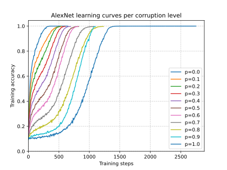
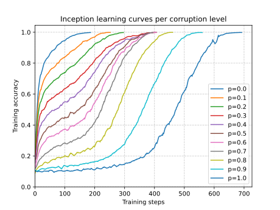

# Understanding generalization in deep learning

A work on generalization in deep learning, let's try to reproduce CIFAR10 experiments from figure 1 and 2

> Chiyuan Zhang, Samy Bengio, Moritz Hardt, Benjamin Recht, Oriol Vinyals. Understanding deep learning requires rethinking generalization. International Conference on Learning Representations (ICLR), 2017. [Arxiv](https://arxiv.org/abs/1611.03530).

For runned experiments see [comet_ml](https://www.comet.com/david-inf/deep-learning-generalization/)

<details>
<summary>Code organization</summary>

```bash
pip install -r requirements.txt
```

Go to the `src/` directory

- `checkpoints` and `experiments` will be automatically created for storing models' `.pt` and `.yaml` configuration files respectively in model subfolders
  - The checkpoints are automatically produced during training giving the `checkpoint_every` argument, otherwise at the end when `num_epochs` is reached
  - There is a configuration file per each single run per each model
- `models/` directory with implemented models
  - `alexnet.py` for the small version of AlexNet -> `AlexNetSmall`
  - `inception.py` for the small version of Inception-V3 -> `InceptionSmall`
  - `mlp.py` for MLP for `MLP1` with `1x512` and `MLP3` with `3x512`
  - `wideresnet.py` for the WideResNet version for CIFAR10 -> `WideResNet`
- `plots/` plots from data samples and results (data from `comet_ml`)
- `cifar10.py` wrapper of torchvision CIFAR10 that supports label and data corruption
  - `CorruptedCIFAR10` for experiments from figure 1
  - `MyCIFAR10` for experiments from figure 2
- `cmd_args.py` arguments for main programs (--config for passing the yaml file and --view for inspecting the given model from the configuration file)
- `main_fig1.py` `main_fig2.py` main scripts from which a single experiment can be launched using command line, different main for experiments from figure 1 and figure 2
- `train.py` used in main script, contains training utilities
- `utils.py` more utilities

```bash
python main_fig1.py --help
```

For inspecting models simply run (always from the `src/` folder) `python main_fig1.py --config experiments/MLP1/MLP1_0.0_none.yaml --view` this will not train the model, instead for the given architecture will show parameters, layers...

Alert: when running it will attempt to connect to comet_ml, provide api key otherwise go comment the code, sorry :)

</details>


### :open_file_folder: Details

Supervised learning on CIFAR10, how far can we push neural nets generalization? What are neural nets able to learn? We need to understand the effective model capacity of neural networks. And what is the impact of implicit regularization from the model itself?

<details open>
<summary>Models</summary>

You can find all the implemented models in the `src/models/` directory

| Model              | Params    | `batch_size` | `lr`   | `momentum` | scheduler         |
| ------------------ | --------- | ------------ | ------ | ---------- | ----------------- |
| `MLP1`             | 1,209,866 | `128`        | `0.01` | `0.9`      | multi-step        |
| `MLP3`             | 1,735,178 | `128`        | `0.01` | `0.9`      | exponential decay |
| `AlexNet`          | 1,375,690 | `128`        | `0.01` | `0.9`      | exponential decay |
| `Inception`        | 1,651,114 | `128`        | `0.1`  | `0.9`      | exponential decay |
| `Inception w/o BN` | 1,647,690 | `128`        | `0.1`  | `0.9`      | exponential decay |
| `WideResNet`       | 1,549,850 | `128`        | `0.01` | `0.9`      | exponential decay |

No weight decay, dropout or other forms of explicit regularization. `Inception` has also the flag for using the batch norm layer, default is `bn=True`, this will be used for the experiments from figure 2.

- `python main_fig1.py --config experiments/MLP1/MLP1_0.0_none.yaml --view`
- `python main_fig1.py --config experiments/MLP3/MLP3_0.0_none.yaml --view`
- `python main_fig1.py --config experiments/AlexNet/AlexNet_0.0_none.yaml --view`
- `python main_fig1.py --config experiments/Inception/Inception_bnTrue.yaml --view`
- `python main_fig1.py --config experiments/Inception/Inception_bnFalse.yaml --view`
- `python main_fig1.py --config experiments/WRN/WRN_0.0_none.yaml --view`

</details>

<details open>
<summary>Data</summary>

- Experiments from figure 1: corrupted labels (not shown here) and data (in three different ways) then see if neural nets can still learn where no relationship between data and labels exists, and data itself makes no sense
- Experiments from figure 2: see the effect of batch norm (implicit regularization) on Inception architecture with original data

<p align="middle">
  
  &nbsp;
  
  &nbsp;
  
  &nbsp;
  
</p>

</details>


## :one: Effective capacity of neural networks

<details>
<summary>Base configuration file</summary>

Experiments naming: `model_name`\_`label_corruption_prob`\_`data_corruption_type`

- `batch_size: 128`
- `checkpoint_dir: checkpoints/MLP1` or `checkpoints/AlexNet` or `checkpoints/Inception` or `checkpoints/WRN`
- `checkpoint_every: null` checkpoints at the end of training, then continues to checkpoint every `num_epochs`
- `comet_project: deep-learning-generalization`
- `config: experiments/MLP1/MLP1_0.0_none.yaml` (as an example)
- `curve: false` whether to continue training to `num_epochs` of stop when interpolation threshold is reached
- `data_corruption_type: none` otherwise `shuff_pix` `rand_pix` `gauss_pix`
- `device: cuda`
- `experiment_key: null` automatically set when the experiment starts
- `experiment_name: MLP1_0.0_none`
- `figure1: true`
- `interp_reached: false` when interpolation threshold has been reached
- `label_corruption_prob: 0.0` from 0.0 to 1.0
- `learning_rate: 0.01`
- `log_every: 50` log training metrics
- `lr_decay: 0.95`
- `model_name: MLP1` or `AlexNet` or `Inception` or `WRN`
- `momentum: 0.9`
- `num_epochs: 10`
- `num_workers: 2`
- `resume_checkpoint: null` automatically set for automated resuming, one just needs to give for example `--epochs 20`
- `seed: 42`
- `weight_decay: 0.0`

```bash
python main_fig1 --config experiments/MLP1/MLP1_0.0_none.yaml --epochs 80
```

</details>


<details open>
<summary>Results</summary>

We present the results for the three experiments aimed at investingating the effective model capacity of neural networks. Note that each curve has been smoothed with `scipy.signal.savgol_filter`.

- Random labels has a significant impact on the learning curve.
- The perfomance here depends also on the model complexity. Optimization plays an important role as well, the learning rate scheduler gives a significant help.
- On the other hand we see here that the model complexity allows to reach a lower test error. However, whatever the model complexity, on random labels it cannot reach better performance than random guessing on test data.

<details open>
<summary>Learning curves</summary>

We keep track of the cross-entropy loss per training step varying randomization test (random labels and data corruption). We do this experiments for each considered architecture.

Test | Description | Argument
--- | --- | ---
True labels | Original CIFAR10 dataset | `label_corruption_prob=0.0`
Random labels | Dataset with random labels both on train and test | `label_corruption_prob=1.0`
Shuffled pixels | A fixed pixels permutation is applied to train and test images | `data_corruption_type: shuff_pix`
Random pixels | Random pixels permutation for each train and test image | `data_corruption_type: rand_pix`
Gaussian | Train and test images are generated according to a Gaussian distribution with matching mean and std to the full dataset | `data_corruption_type: gauss_pix`

<p align="middle">
  
  &nbsp;
  
  &nbsp;
  
</p>

<p align="middle">
  
  &nbsp;
  
</p>

</details>

<details open>
<summary>Convergence slowdown and Generalization error growth</summary>

Time to reach the interpolation threshold (minutes) againts label corruption for each network. At the same time the generalization error can be computed. One must run 11 experiments for the corrution levels per each architectures.

Generalization error is defined as the difference between test error and training error, since the metric is computed at the interpolation threshold, the actual generalization error is the test error.

We should see that as the label corruption level increases, the time to reach the interpolation threshold increases as well. So, in other terms, finding the class separation as the corruption level increases is harder but not impossible to learn for neural networks. Same phenomenon for the test error, as the model learns a "relationship" between data and targets that do not exists in the test set.

Conververgence slowdown, however, considers the model complexity, in fact we see that the Inception architecture followed by AlexNet takes far more time than other models. This, also, is influenced by the used hardware, i.e. other processes running at the same but it remains that the Inception architecture is the most expensive one in terms of computational cost.

<p align="middle">
  
  &nbsp;
  
</p>

The complexity reflexes on the test error tough, being Inception the most expensive since the many layers, it is able to reach the lowest test error per each label corruption level (exception on random labels where each model cannot do better than random guessing). We should also note that the Inception is followed by the WideResNet, but with a far lower computational cost!

</details>

</details>

<details>
<summary>Logging</summary>

Train `MLP1` model on CIFAR10 with partially corrupted labels

```bash
python main_fig1.py --config experiments/MLP1/MLP1_0.5_none.yaml --epochs 50
Updated epochs from 20 to 50
Checkpoint every 20
COMET INFO: Experiment is live on comet.com [...]

Running MLP1_0.5_none
Loading checkpoint: checkpoints/MLP1/e_020_MLP1_0.5_none.pt
Resuming training from epoch 21, step 180, previous runtime 15.91s
021: 100%|████████████████████████████████████████████| 391/391 [00:00<00:00, 459.92batch/s, train_acc=0.562, train_loss=1.34]
022: 100%|████████████████████████████████████████████| 391/391 [00:00<00:00, 443.12batch/s, train_acc=0.577, train_loss=1.29]
023: 100%|████████████████████████████████████████████| 391/391 [00:00<00:00, 460.65batch/s, train_acc=0.602, train_loss=1.24]
...
049: 100%|████████████████████████████████████████████| 391/391 [00:00<00:00, 486.09batch/s, train_acc=0.898, train_loss=0.467]
050: 100%|████████████████████████████████████████████| 391/391 [00:00<00:00, 517.96batch/s, train_acc=0.901, train_loss=0.455]
Saved checkpoint e_050_MLP1_0.5_none.pt at epoch 50, step 450, runtime 40.24s
Training completed in 24.35s <> Current runtime: 40.25s
Current training at epoch 50, step 450
```

```bash
python main_fig1.py --config experiments/MLP1/MLP1_0.0_none.yaml --epochs 90
Updated epochs from 70 to 90
Checkpoint every 20
COMET INFO: Experiment is live on comet.com [...]

Running MLP1_0.0_none
Loading checkpoint: checkpoints/MLP1/e_070_MLP1_0.0_none.pt
Resuming training from epoch 71, step 630, previous runtime 59.63s
071: 100%|█████████████████████████████████████████████| 391/391 [00:00<00:00, 413.14batch/s, train_acc=0.997, train_loss=0.0706]
072: 100%|█████████████████████████████████████████████| 391/391 [00:00<00:00, 506.75batch/s, train_acc=0.997, train_loss=0.0702]
073: 100%|█████████████████████████████████████████████| 391/391 [00:00<00:00, 465.85batch/s, train_acc=0.997, train_loss=0.0698]
074: 100%|█████████████████████████████████████████████| 391/391 [00:00<00:00, 466.58batch/s, train_acc=0.997, train_loss=0.0693]
075: 100%|█████████████████████████████████████████████| 391/391 [00:00<00:00, 473.89batch/s, train_acc=0.997, train_loss=0.069]
076: 100%|█████████████████████████████████████████████| 391/391 [00:00<00:00, 451.35batch/s, train_acc=0.997, train_loss=0.0686]
077: 100%|█████████████████████████████████████████████| 391/391 [00:00<00:00, 498.46batch/s, train_acc=0.997, train_loss=0.0682]
Zero-loss condition reached at epoch 77 after 65.52s
Test accuracy: 53.1%
Interpolation threshold reached, and no need to continue, breaking training...
Training completed in 6.25s <> Current runtime: 65.89s
Current training at epoch 78, step 69
```

</details>


## :two: Implicit regularization

<details>
<summary>Base configuration file</summary>

Experiments naming: Inception_bn`bn` (since in this experiments on the Inception architecture is involved)

- `batch_size: 128`
- `bn: true` or `false`
- `checkpoint_every: null`
- `comet_project: deep-learning-generalization`
- `device: cuda`
- `experiment_key: null`
- `experiment_name: Inception_bnTrue`
- `figure1: false`
- `learning_rate: 0.1`
- `log_every: 100`
- `lr_decay: 0.95`
- `model_name: Inception`
- `momentum: 0.9`
- `num_epochs: 5`
- `num_workers: 2`
- `resume_checkpoint: null`
- `seed: 42`
- `weight_decay: 0.0`

```bash
python main_fig2.py --config experiments/Inception/Inception_bnTrue.yaml --epochs 50
```

</details>

<details open>
<summary>Results</summary>

We see the influence of the batch norm layer as a form of implicit regularization

<p align="middle">
  
  &nbsp;
  
</p>

Batch norm allows Inception to reach the interpolation threshold earlier, and influences the generalization error as well. There isn't much evidence of a more stable training with batch norm.

</details>


## :ballot_box_with_check: Other results

<details>
<summary>Seed importance</summary>

The importance of seed with randomization experiments: when no seed is provided, for example in case of resuming (two times here), the model confronts with new data, so it is like testing, except that the new data has an unknown distribution. When the seed is provided, the training continues smoothly in case of resuming.

<p align="middle">
  
</p>

</details>

<details open>
<summary>Different view of generalization error growth</summary>

Another perspective on the generalization error growth phenomenon for MLP1 and MLP3

<p align="middle">
  
  &nbsp;
  
</p>

Another perspective on the generalization error growth for AlexNet, Inception and WRN

<p align="middle">
  
  &nbsp;
  
  &nbsp;
  
</p>

This confirms that as the label corruption level increases, the time required to reach interpolation threshold increses as well. So there is a relationship between convergence amd label corruption.

</details>
