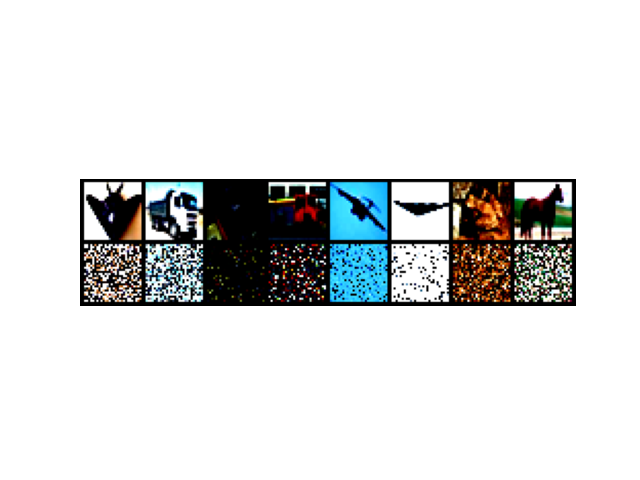

# Understanding generalization in deep learning

A work on generalization in deep learning, let's try to reproduce CIFAR10 experiments from figure 1 and 2

> Chiyuan Zhang, Samy Bengio, Moritz Hardt, Benjamin Recht, Oriol Vinyals. Understanding deep learning requires rethinking generalization. International Conference on Learning Representations (ICLR), 2017. [Arxiv](https://arxiv.org/abs/1611.03530).

<details>
<summary>Code organization</summary>

```
pip install -r requirements.txt
```

Go to the `src/` directory, then you will find the following programs

- `checkpoints` and `experiments` will be automatically created for storing models' `.pt` and `.yaml` configuration files respectively
  - `config-f1.yaml` `config-f2.yaml` base configurations for experiments, use `generate_config.py` for custom configurations
- `models/` directory with implemented models (detailed below)
- `plots/` plots from data samples and results
- `cifar10.py` wrapper of torchvision CIFAR10 that supports label and data corruption
- `cmd_args.py` arguments for main programs
- `main_fig1.py` `main_fig2.py` main script from which a single experiment can be launched using command line, different main for experiments from figure 1 and figure 2
- `train.py` used in main script, contains training utilities
- `utils.py` more utilities

Use `python main_fig1.py --help` and `python main_fig2.py --help` to show program arguments

For inspecting models simply run `python main_fig1.py --config experiments/MLP1/MLP1_0.0_none.yaml --view` this will not train the model, instead for the given architecture will show parameters, layers...

</details>


### :open_file_folder: Details

Supervised learning on CIFAR10, how far can we push neural nets generalization?

<details open>
<summary>Models</summary>

You can find all the implemented models in the `src/models/` directory, go to the `src/` folder then use for example `python main_models.py --config experiments/MLP1/MLP1_0.0_none.yaml`

| Model        | Params    | `batch_size` | `learning_rate` | `momentum` | scheduler                  |
| ------------ | --------- | ------------ | --------------- | ---------- | -------------------------- |
| `MLP1`       | 1,209,866 | `128`        | `0.01`          | `0.9`      | multi-step 0.1 at [100]    |
| `MLP3`       | 1,735,178 | `128`        | `0.01`          | `0.9`      | multi-step 0.1 at [100]    |
| `AlexNet`    | 1,375,690 | `128`        | `0.01`          | `0.9`      | decay with $\gamma$ `0.95` |
| `Inception`  | 1,651,114 | `128`        | `0.1`           | `0.9`      | decay with $\gamma$ `0.95` |
| `WideResNet` | 1,549,850 | `128`        | `0.01`          | `0.9`      | decay with $\gamma$ `0.95` |

No weight decay, dropout or other forms of explicit regularization

`Inception` has also the flag for using the batch norm layer, default is `bn=True` this will be used for the experiments from figure 2

</details>

<details open>
<summary>Data</summary>

- Experiments from figure 1: corrupt labels (non shown here) and data (in three different ways) then see if neural nets can still learn where no relationship between data and labels exists
- Experiments from figure 2: see the effect of batch norm on Inception architecture with original data

<div style="display: flex; flex-direction: row;">
  
  &nbsp;
  
  &nbsp;
  
  &nbsp;
  
</div>

</details>


## :one: Experiments from Figure 1

<details>
<summary>Configuration files</summary>

Experiments naming: `model_name`\_`label_corruption_prob`\_`data_corruption_type`

- `batch_size: 128`
- `checkpoint_dir: checkpoints/MLP1` or `checkpoints/AlexNet` or `checkpoints/Inception`
- `checkpoint_every: null`
- `comet_project: `
- `config: experiments/MLP1/MLP1_0.0_none.yaml` (as an example)
- `curve: false`
- `data_corruption_type: none`
- `device: cuda`
- `experiment_key: ` (see main program)
- `experiment_name: MLP1_0.0_none`
- `figure1: true`
- `interp_reached: false`
- `label_corruption_prob: 0.0`
- `learning_rate: 0.01`
- `log_every: 50`
- `lr_decay: 0.95`
- `model_name: MLP1` or `AlexNet` or `Inception`
- `momentum: 0.9`
- `num_epochs: 10`
- `num_workers: 2`
- `resume_checkpoint: ` (see training loop)
- `seed: 42`
- `weight_decay: 0.0`

```bash
python main_fig1 --config experiments/MLP1/MLP1_0.0_none.yaml --epochs 80
```

</details>

<details>
<summary>Learning curves</summary>

Loss per training step varying randomization test

- **True labels**: original CIFAR10 dataset `p=0.0`
- **Random labels**: dataset with random labels both train and test, probability (fraction) specified by `p=1.0`
- **Shuffled pixels**: a fixed pixels permutation is applied to train and test images
- **Random pixels**: different pixels permutation for each train and test image
- **Gaussian**: train and test images are generated according to a normal distribution with matching mean and std to the full dataset

Fixed architecture (`AlexNet`) with varying randomization test

</details>

<details>
<summary>Convergence slowdown</summary>

Time to reach the interpolation threshold againts label corruption for each network. One must run 11 experiments for the corrution levels per 3 different architectures.

We should see that as the label corruption level increases, the time to reach the interpolation threshold increases as well. However this also accounts for the model complexity.

</details>

<details>
<summary>Generalization error growth</summary>

Test error at the interpolaton threshold against label corruption level for each network. Same as the previous experiment, just with another metric
</details>

<details open>
<summary>Results</summary>

<div style="display: flex; flex-direction: row;">
  
  &nbsp;
  
  &nbsp;
  
</div>

- Random labels has a significant impact on the learning curve.
- The perfomance here depends also on the model complexity. Optimization plays an important role as well, the learning rate scheduler gives a significant help.
- On the other hand we see here that the model complexity allows to reach a lower test error. However, whatever the model complexity, on random labels it cannot reach better performance than random guessing on test data.

</details>

<details>
<summary>Logging</summary>

Train `MLP1` model on CIFAR10 with half-corrupted labels

```bash
python main_fig1.py --config experiments/MLP1/MLP1_0.5_none.yaml --epochs 50
Updated epochs from 20 to 50
Checkpoint every 20
COMET INFO: Experiment is live on comet.com [...]

Running MLP1_0.5_none
Loading checkpoint: checkpoints/MLP1/e_020_MLP1_0.5_none.pt
Resuming training from epoch 21, step 180, previous runtime 15.91s
021: 100%|████████████████████████████████████████████| 391/391 [00:00<00:00, 459.92batch/s, train_acc=0.562, train_loss=1.34]
022: 100%|████████████████████████████████████████████| 391/391 [00:00<00:00, 443.12batch/s, train_acc=0.577, train_loss=1.29]
023: 100%|████████████████████████████████████████████| 391/391 [00:00<00:00, 460.65batch/s, train_acc=0.602, train_loss=1.24]
...
049: 100%|████████████████████████████████████████████| 391/391 [00:00<00:00, 486.09batch/s, train_acc=0.898, train_loss=0.467]
050: 100%|████████████████████████████████████████████| 391/391 [00:00<00:00, 517.96batch/s, train_acc=0.901, train_loss=0.455]
Saved checkpoint e_050_MLP1_0.5_none.pt at epoch 50, step 450, runtime 40.24s
Training completed in 24.35s <> Current runtime: 40.25s
Current training at epoch 50, step 450
```

```bash
python main_fig1.py --config experiments/MLP1/MLP1_0.0_none.yaml --epochs 90
Updated epochs from 70 to 90
Checkpoint every 20
COMET INFO: Experiment is live on comet.com [...]

Running MLP1_0.0_none
Loading checkpoint: checkpoints/MLP1/e_070_MLP1_0.0_none.pt
Resuming training from epoch 71, step 630, previous runtime 59.63s
071: 100%|█████████████████████████████████████████████| 391/391 [00:00<00:00, 413.14batch/s, train_acc=0.997, train_loss=0.0706]
072: 100%|█████████████████████████████████████████████| 391/391 [00:00<00:00, 506.75batch/s, train_acc=0.997, train_loss=0.0702]
073: 100%|█████████████████████████████████████████████| 391/391 [00:00<00:00, 465.85batch/s, train_acc=0.997, train_loss=0.0698]
074: 100%|█████████████████████████████████████████████| 391/391 [00:00<00:00, 466.58batch/s, train_acc=0.997, train_loss=0.0693]
075: 100%|█████████████████████████████████████████████| 391/391 [00:00<00:00, 473.89batch/s, train_acc=0.997, train_loss=0.069]
076: 100%|█████████████████████████████████████████████| 391/391 [00:00<00:00, 451.35batch/s, train_acc=0.997, train_loss=0.0686]
077: 100%|█████████████████████████████████████████████| 391/391 [00:00<00:00, 498.46batch/s, train_acc=0.997, train_loss=0.0682]
Zero-loss condition reached at epoch 77 after 65.52s
Test accuracy: 53.1%
Interpolation threshold reached, and no need to continue, breaking training...
Training completed in 6.25s <> Current runtime: 65.89s
Current training at epoch 78, step 69
```

</details>


## :two: Experiments from Figure 2

<details>
<summary>Configuration files</summary>

Experiments naming: Inception_bn`bn` (since in this experiments on the Inception architecture is involved)

- `batch_size: 128`
- `bn: true` or `false`
- `checkpoint_every: null`
- `comet_project: `
- `device: cuda`
- `experiment_key: null`
- `experiment_name: Inception_bnTrue`
- `figure1: false`
- `learning_rate: 0.1`
- `log_every: 100`
- `lr_decay: 0.95`
- `model_name: Inception`
- `momentum: 0.9`
- `num_epochs: 5`
- `num_workers: 2`
- `resume_checkpoint: null`
- `seed: 42`
- `weight_decay: 0.0`

```bash
python main_fig2.py --config experiments/Inception/Inception_bnTrue.yaml
```

</details>

| Learning curves | Validation curves |
| --------------- | ----------------- |
| plot            | plot              |


## :ballot_box_with_check: Other results

| **Description** | **Result** |
| -------------------------------------------- | ------------------------- |
| The importance of seed with randomization experiments: when no seed is provided, for example in case of resuming (two times here), the model confronts with new data, so it is like testing, except that the new data has an unknown distribution. When the seed is provided, the training continues smoothly in case of resuming. |  |
